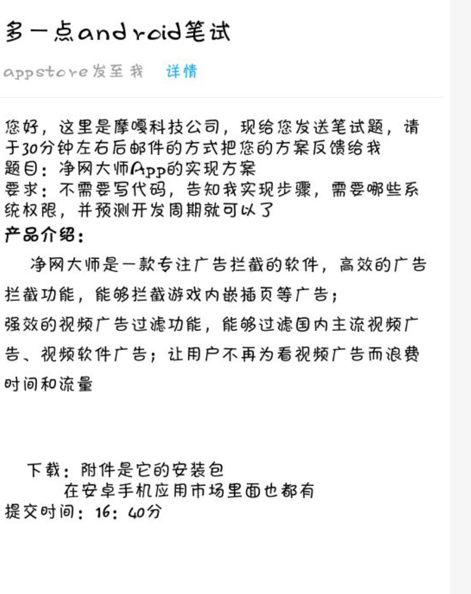
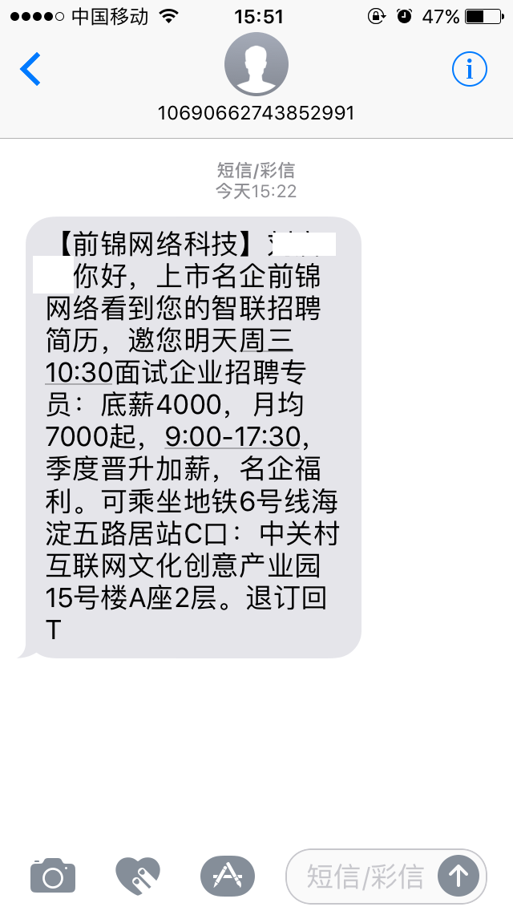

# pcompany

## CX

1. 天津远为科技

## PX

1. 百影世纪(北京)文化传媒有限公司
1. 北京雨艳传媒有限公司
1. 北京博创智软科技有限公司
1. 北京博达远创科技发展有限公司
1. 北京春玉影视文化传媒有限公司
1. 北京顶测科技有限公司
1. 北京东方龙月科技有限公司
1. 北京东软睿道教育科技有限公司
1. 北京富尧软件有限公司
1. 北京广盟科技有限公司
1. 北京海新创业科技有限公司
1. 北京弘睿千里信息技术有限公司
1. 北京九州盛景科技有限公司
1. 北京卡爱特科技有限公司
1. 北京朗思云端信息技术有限公司
1. 北京理博软件科技有限公司
1. 北京清睿创新科技有限公司
1. 北京瑞明恒通科技有限公司
1. 北京伟林鑫越科技有限公司
1. 北京仲联达科技有限公司
1. 博彦高科(北京)软件有限公司
1. 东软联创(北京)科技有限公司
1. 阁瑞钛伦特软件(北京)有限公司
1. 硅谷汇（北京）软件技术有限公司
1. 国投联创(北京)软件有限公司
1. 宏林云创（北京）科技有限公司
1. 华软汇智（北京）国际软件技术研究院
1. 华威信科（北京）科技有限公司
1. 华为高科(北京)软件有限公司菏泽分公司
1. 华为联创软件(北京)有限公司
1. 华为云软(北京)软件有限公司
1. 京东联创（北京）科技有限公司
1. 联创云时代(北京)软件有限公司
1. 路猫加速器科技（北京）有限公司
1. 清软高科(北京)科技有限公司
1. 拓普互联（北京）科技有限公司
1. 网易高科(北京)软件有限公司
1. 微码云（北京）软件有限公司
1. 新东方教育科技集团
1. 易卓普软件（北京）有限公司
1. 因特驰软件(北京)有限公司
1. 云全栈(北京)软件技术有限公司
1. 云软高科(北京)软件有限公司
1. 云涯谷（北京）软件技术有限公司
1. 中创科达(北京)科技有限公司
1. 中开联创(北京)科技有限公司
1. 中科富盈（北京）科技有限公司
1. 中软高科（北京）科技有限公司
1. 中软互联(北京)科技有限公司
1. 中软基地(北京)科技有限公司
1. 中软开创（北京）科技有限公司
1. 中软通达（北京）科技有限公司
1. 中软云创(北京)科技有限公司
1. (MLDN)魔乐科技
1. 八维教育
1. 北大青鸟
1. 北京火星人科技文化发展中心
1. 北京尚学堂
1. 传智播客
1. 翡翠教育
1. 国信蓝点
1. 黑马
1. 励牛课思(北京)信息技术有限公司
1. 普科优信
1. 卓新思创科技有限公司
1. 飞雀教育
1. 百知教育
1. 荣新广域
1. 中青才智教育投资（北京）有限公司
1. 北京志联利盟科技发展有限公司
1. 北京彼端科技有限公司
1. 北京乐美无限科技有限公司
1. 蓝科科技
1. 菜鸟科技
1. 完美动力
1. 中软创新（北京）科技有限公司
1. 蓝桥
1. 北京水晶石计算机技术培训有限公司
1. 新大陆时代教育
1. 任我行
1. 中软中科
1. 大华明智软件有限公司
1. 博创智软
1. 测试空间
1. 互联网佳
1. 信达爱瑞
1. 蓝鸥
1. 信雨同盟国际科技中心
1. 中明盈佳（北京）计算机科技有限公司
1. 燕园英才
1. 汇众益智
1. 理博软件
1. 时光机（代码直播）
1. 因特迟

## PP

1. 摩 嘎 科 技 实现某一个软件的思路，群发邮件，不沟通面试 2016/11/22
   
1. 前锦网络 群发短信，岗前付费 不推荐
   
